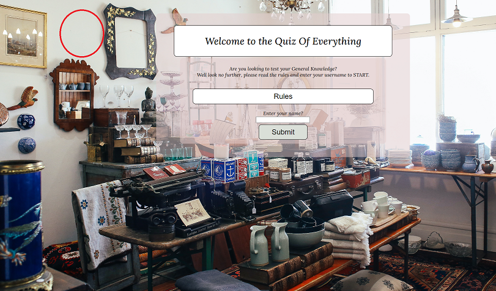
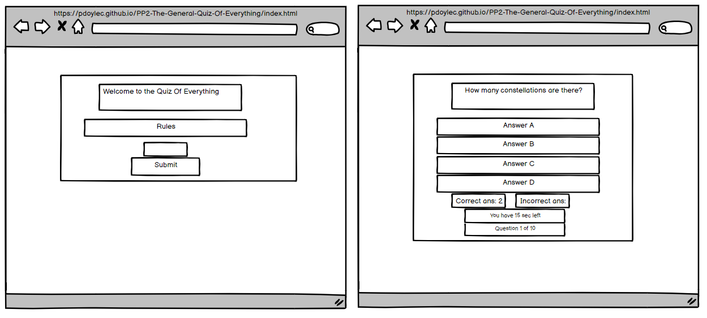
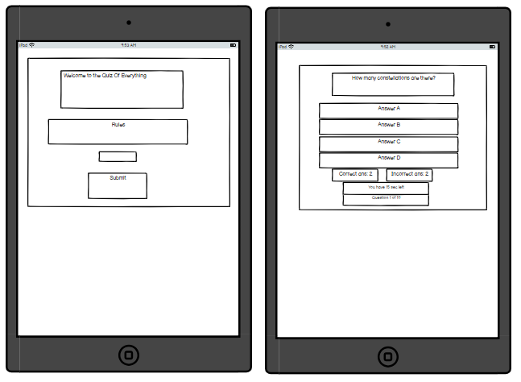
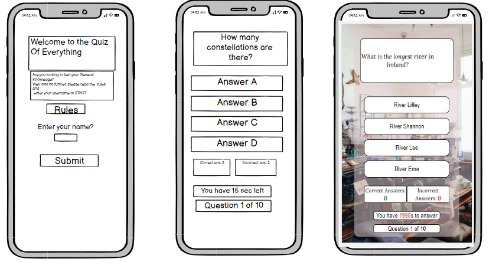
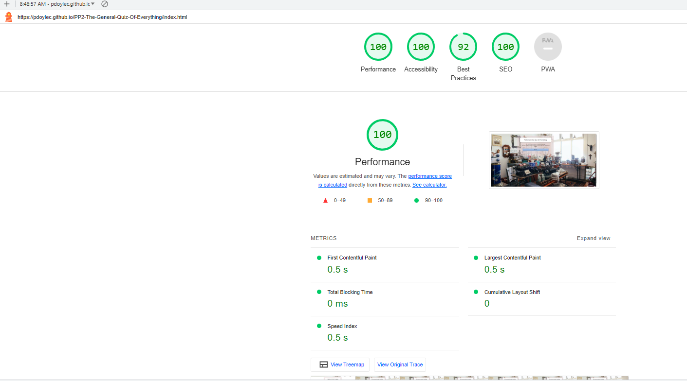
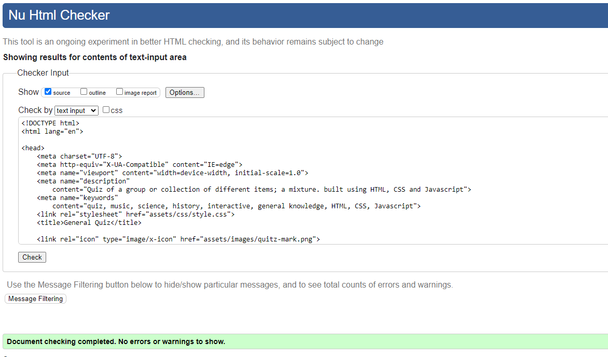
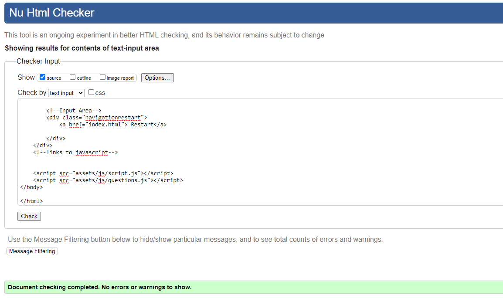
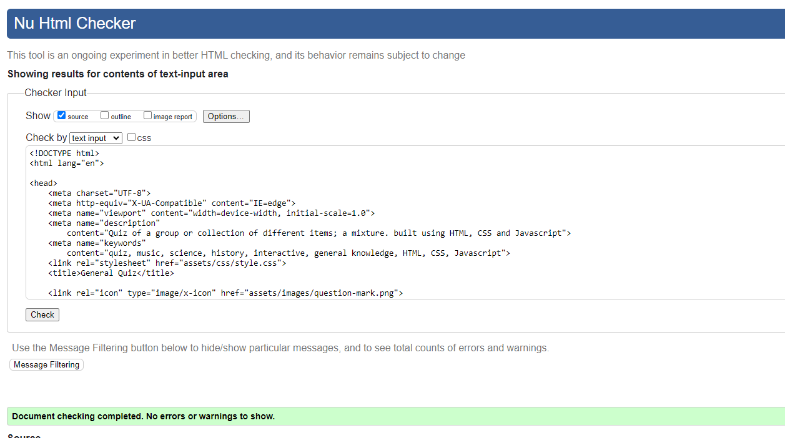
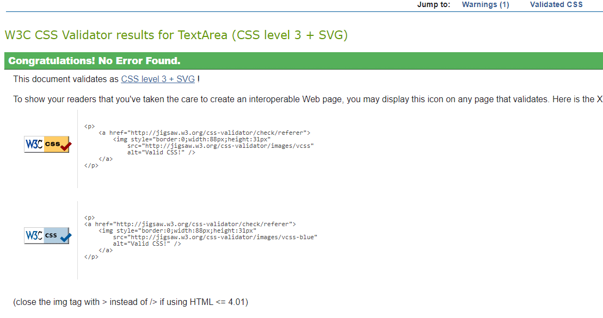
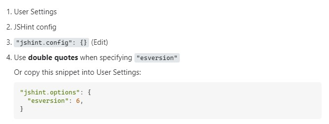

<h1 align="center">The General Quiz Of Everything</h1>

[View the live project here](https://pdoylec.github.io/PP2-The-General-Quiz-Of-Everything/)

The General Quiz Of Everything is a site where people can come and test there knowledge.

## Contents

## Project Goals

- To create a quiz that covers a wide variety of subjects.
- To have the score displayed at the end.
- To be able to enter a user name and have displayed with the score.
- To have a reset or restart button.
- There will be a choice of answers to choose from.
- The correct answer will be displayed when the question is answered.
- For the quiz to be the same as a timed exam, when the time is up the quiz will end.

### User Feedback

- Liked the questions, and would nice if there was dificulty levels like easy mediun or hard level.
- Have a category for different questions, e.g. Science, history, TV, Movie and pick the category at the start of the quiz.
- A user didn't know that the quiz would end after 20 seconds, so I implemented that the submit and start button would only appear after the rules have been opened.
- The quiz time limit was originally 20 seconds, and some peoples feedback said that the 20secs wasn't enough, so the time was increased to 25 seconds.
- One user would like it if there could be dificulty levels with the time also, having a choice of 20 sec or 25 secs or 30 sec per question.
- Have a leader board for a group of people to compare scores.
- One user wanted to be able a check there answer after it was answered before moving onto the next question, which would mean for the timer to stop and start again. This was covered below in the Future Adaptations section of the README.

## Features

- There are 10 questions that appeared randomly out of a totol of 40.
- The players score is visible on the screen under the quiz.
- There is a countdown timer which end the quiz after 25 seconds if the question isn't answered,which appears after the start button is pressed.
- There is a progress counter which appears after the start button is pressed.
- Rules can be seen by pressing the Rules button.

Features Image

### Background Image

- The image is by Rachel Claire and is from [Pexels.com](https://www.pexels.com/photo/merchandise-in-store-5865390/)

Background Image

[Back to contents](#contents)

## Design

- I wanted to be able to see the background image so the "quiz-section" class was made transparent by 0.5.
- The Rules button is flashing at the start of the quiz to let users know that it needs to be pressed.
- The colour when the buttons are hover over was picked using the eye dropper in chrome developer where the colour can be changed. The colour was picked from the red circle in the image below. This colour is repeated in the image also, in tsome jugs and bowls in the image.

### Fonts

Font Image

[Back to contents](#contents)

## Future Adaptations

- In the future I'd like to add smaller indicators, to show which question was selected and the correct answer if the incorrect was selected.  
  
  
[Back to contents](#contents)

### Wireframes

wireFrame Image

### Programmes used

- Balsamiq
  - For the wireframes
- Git
  - For version control, commiting, and pushing to Github
- Github
  - For storing the repository.
- Codeanywhere
  - IDE used to code the website.
- Chrome developer tools
  - for checking compatibilty, debugging, styling, troubleshooting and editing code.
- jigsaw.w3.org / validator.w3.org / jshint.com
  - For code validation of HTML, CSS & JavaScript
- Am I responsive
  - Used to test responsiveness of the website of the different screen sizes.
- Google Fonts
  - For the font stlye.
- favicon.io
  - For the tab icon.

[Back to contents](#contents)

## Testing and Validation

### Lighthouse

- Lighthouse in chrome developer tool, was used to test the website for:
- Performance - how the page performs whilst loading.
- Accessibility - how accessible is the site for all users and how can it be improved.
- Best practices - how does the site conform to industry best practices.
- SEO - search engine optimization. Is the site optimized for search engine result rankings.

### Code Validation

- HTML, CSS and JavaScript codes where all tested jigsaw.w3.org / validator.w3.org / jshint.com
- JShint was used to test the the JavaScript code, there were a number of warnings for 'const' is available in ES6 (use 'esversion: 6') or Mozilla JS extensions (use moz). The warnings are be removed by Creating jshint in the root directory of the project.

Features Image

### Inspect

remove images and update m-commit and just and text here with tests done.

Inspect Testing

### 404 ERROR

[Back to contents](#contents)

## Deployment and Development

The project was deployed to Github pages using the following steps:
Log into Github and locate the [Github](https://pdoylec.github.io/PP2-The-General-Quiz-Of-Everything/).

## Credits

### Content

- Questions in relation to Always Sunny were found at [Always Sunny link](https://www.joe.ie/movies-tv/quiz-can-beat-gang-get-1520-always-sunny-philadelphia-quiz-576503).
- Questions in relation to general Knowledge were found at [General Knowledge link](https://www.faber.co.uk/journal/quizzes/qi-quiz/).
- Questions in relation to Rick and Morty were found at [Rick and Morty link](https://editorial.rottentomatoes.com/article/ultimate-rick-and-morty-quiz/).
- Questions in relation to Astronomy were found at [Astronomy link](https://thoughtcatalog.com/january-nelson/2021/10/astronomy-trivia/).
- Questions in relation to Predator rivia were found at [Predator Trivia link](https://www.usefultrivia.com/movie_trivia/predator_trivia.html).
- Questions in relation to general Knowledge were found at [General Knowledge link](https://www.mentimeter.com/blog/audience-energizers/55-free-trivia-and-fun-quiz-question-templates#quiz-templates).
- Questions in relation to general Knowledge were found at [General Knowledge link](https://www.cosmopolitan.com/uk/worklife/a32433256/best-hard-general-knowledge-quiz-questions/).
- Questions in relation to general Knowledge were found at [General Knowledge link](http://www.freepubquiz.co.uk/ireland-quiz.html).
- Questions in relation to general Knowledge were found at [General Knowledge link](https://www.beelovedcity.com/ireland-quiz).
- Questions in relation to general Knowledge were found at [General Knowledge link](https://www.mylondon.news/news/zone-1-news/30-tough-pop-music-quiz-18302193).
- Questions in relation to general Knowledge were found at [General Knowledge link](https://thisisgalway.ie/quiz/the-irish-music-quiz-1/).

### Code

- This you tube video for help to get started [You tube link](https://www.youtube.com/watch?v=riDzcEQbX6k).

  - I used,
    - displayQuestion function was copied and used.
    - getNextQuestion function was copied and used.
    - nextquestcurrquest function which I added code to increment number of questions completed.
    - runGame function which I added code to and changed to hide button and added code to increment number of question completed.
    - nextButton function which I added code for the counter I included.
    - checkAnswer function which I manipulated by adding code to increment the score to be displayed at the end, I also added an if else statement to output a comment which is related to the score you got.
  - The code I added.
    - A Timer for each question where there is 25 seconds to answer each question.
    - A Progress counter to let you know which question your on.
    - A user name to display at the end of the quiz with your score and submit button for username.
    - A rules button to show and hide the rules of the quiz.
    - An if else statement which takes the score and displays the score with a comment which is related to the score you got.

- Code institute for course material and content for correct and incorrect scoring.
- Code inspired from CI student Jose Maciel [Link to zemaciel github](https://zemaciel.github.io/project-02/index.html).
- Code inspired from CI student Lisa Tinmurth [Link to mrst12 github](https://mrst12.github.io/Quizzical/).
- Favicon code was found at the following site [Link to Favicon site](https://favicon.io/).
- Code for timer to end quiz [Link to Stack Over Flow site](https://stackoverflow.com/questions/44314897/javascript-timer-for-a-quiz). The code was improved by changing that measurement of the countdown.

### Media

- The image is by Rachel Claire and is from [Pexels.com](https://www.pexels.com/photo/merchandise-in-store-5865390/)

### Acknowledgments

- Thank you to my mentor Elaine Roche who helped with points and tips and gave me very good advice and feedback on how to plan and execute this project and who provided me with lots of pointers for my project.
  [Back to contents](#contents)
