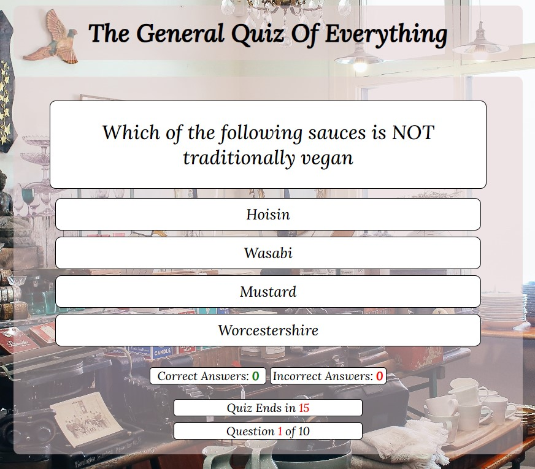

<h1 align="center">The General Quiz Of Everything</h1>

[View the live project here](https://pdoylec.github.io/PP2-The-General-Quiz-Of-Everything/)

The General Quiz Of Everything is a site where people can come and test there knowledge.

## Contents

## Project Goals

- To create a quiz that covers a wide variety of subjects.

### User Feedback

- Liked the questions, and would nice if there was dificulty level or easy mediun or hard level.
-

## UX

## Strategy and Scope

### Target Audience

### User Stories

### User Requirements

[Back to contents](#contents)

## Features

- There are 10 questions that appeared randomly out of a totol of 40.
- The players score is visible on the screen under the quiz.
- There is a countdown timer which end the quiz after 20 seconds if the question isn't answered,which appears after the start button is pressed.
- There is a progress counter which appears after the start button is pressed.
- Rules can be seen by pressing the Rules button.

Features Image

### Background Image

- The image is by Rachel Claire and is from [Pexels.com](https://www.pexels.com/photo/merchandise-in-store-5865390/)

Background Image

[Back to contents](#contents)

## Design

### Fonts

Font Image

[Back to contents](#contents)

## Future Adaptations

- I'd like to implement an end of quiz statement in relation to the score, i.e. if the score was below 4 there would be a message to say something along the lines of "more study is needed".
- In the future I'd like to add smaller indicators, to show which question was selected and the correct answer if the incorrect was selected.  
  

### Future changes

[Back to contents](#contents)

## Structure and Skeleton

### Wireframes

### Programmes used

- Balsamiq
  - For the wireframes
- Git
  - For version control, commiting, and pushing to Github
- Github
  - For storing the repository.
- Codeanywhere
  - IDE used to code the website.
- Chrome developer tools
  - for checking compatibilty, debugging, styling, troubleshooting and editing code.
- jigsaw.w3.org / validator.w3.org / jshint.com
  - For code validation of HTML, CSS & JavaScript
- Am I responsive
  - Used to test responsiveness of the website of the different screen sizes.
- Google Fonts
  - For the font stlye.
- favicon.io
  - For the tab icon.

### Home Page

[Back to contents](#contents)

## Testing and Validation

### Code Validation

### Lighthouse

### WAVE

### Site Validation

Connection Test

### Inspect

Inspect Testing

### 404 ERROR

[Back to contents](#contents)

## Bugs \& ERRORS

## Unresolved Bugs

## Deployment and Development

The project was deployed to Github pages using the following steps:
Log into Github and locate the [Github](https://pdoylec.github.io/PP2-The-General-Quiz-Of-Everything/).

## Technologies Used

[Back to contents](#contents)

## Credits

### Content

- Questions in relation to Always Sunny were found at [Always Sunny link](https://www.joe.ie/movies-tv/quiz-can-beat-gang-get-1520-always-sunny-philadelphia-quiz-576503).

- Questions in relation to general Knowledge were found at [General Knowledge link](https://www.faber.co.uk/journal/quizzes/qi-quiz/).

- Questions in relation to Rick and Morty were found at [Rick and Morty link](https://editorial.rottentomatoes.com/article/ultimate-rick-and-morty-quiz/).

- Questions in relation to Astronomy were found at [Astronomy link](https://thoughtcatalog.com/january-nelson/2021/10/astronomy-trivia/).

- Questions in relation to Predator rivia were found at [Predator Trivia link](https://www.usefultrivia.com/movie_trivia/predator_trivia.html).

- Questions in relation to general Knowledge were found at [General Knowledge link](https://www.mentimeter.com/blog/audience-energizers/55-free-trivia-and-fun-quiz-question-templates#quiz-templates).

- Questions in relation to general Knowledge were found at [General Knowledge link](https://www.cosmopolitan.com/uk/worklife/a32433256/best-hard-general-knowledge-quiz-questions/).

- Questions in relation to general Knowledge were found at [General Knowledge link](http://www.freepubquiz.co.uk/ireland-quiz.html).

- Questions in relation to general Knowledge were found at [General Knowledge link](https://www.beelovedcity.com/ireland-quiz).

- Questions in relation to general Knowledge were found at [General Knowledge link](https://www.mylondon.news/news/zone-1-news/30-tough-pop-music-quiz-18302193).

- Questions in relation to general Knowledge were found at [General Knowledge link](https://thisisgalway.ie/quiz/the-irish-music-quiz-1/).

### Code

- This you tube video for help to get started [You tube link](https://www.youtube.com/watch?v=riDzcEQbX6k).
- Code Inspired by fellow Code Institute students Lisa Tinmurth [Github](https://mrst12.github.io/Quizzical/). Code was added to, by implementing a timer, progress counter, user name.
- Code institute for course material and content for correct and incorrect scoring.
- Favicon code was found at the following site [Link to Favicon site](https://favicon.io/).
- Code for timer to end quiz [Link to Stack Over Flow site](https://stackoverflow.com/questions/44314897/javascript-timer-for-a-quiz). The code was improved by changing that measurement of the countdown.

### Media

### Acknowledgments

[Back to contents](#contents)
