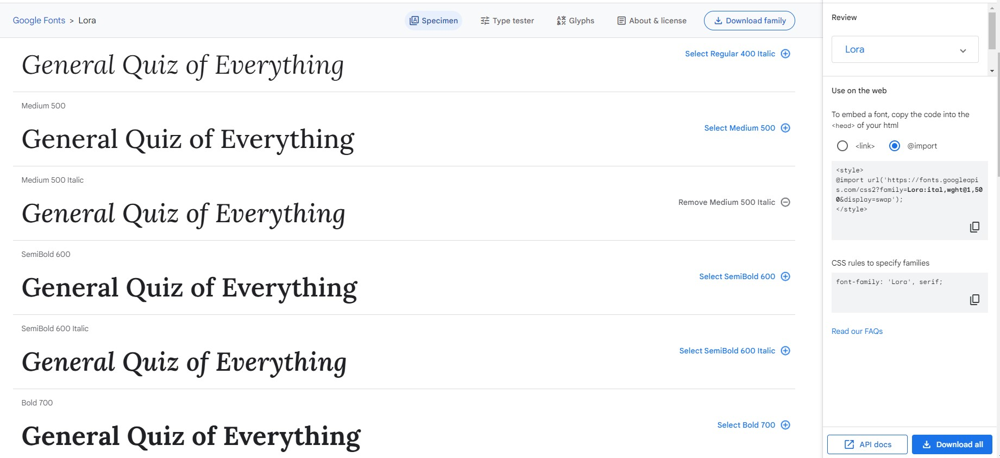

<h1 align="center">The General Quiz Of Everything</h1>

[View the live project here](https://pdoylec.github.io/PP2-The-General-Quiz-Of-Everything/)

The General Quiz Of Everything is a site where people can come and test there knowledge.

## Contents

## Project Goals

- To create a quiz that covers a wide variety of subjects.

### User Feedback

## UX

## Strategy and Scope

### Target Audience

### User Stories

### User Requirements

[Back to contents](#contents)

## Features

- There are 10 questions that appeared randomly out of a totol of 40.
- The players score is visible on the screen under the quiz.
- There is a countdown timer which end the quiz after 20 seconds if the question isn't answered,which appears after the start button is pressed.
- There is a progress counter which appears after the start button is pressed.

Features Image

### Background Image

- The image is by Rachel Claire and is from [Pexels.com](https://www.pexels.com/photo/merchandise-in-store-5865390/)

Background Image

### Footer

[Back to contents](#contents)

## Design

### Color Scheme

### Color Contrast

### Fonts

Font Image

[Back to contents](#contents)

## Future Adaptations

In the future I'd like to add smaller indicators, to show which question was selected and the correct answer if the incorrect was selected.  

### Future changes

[Back to contents](#contents)

## Structure and Skeleton

### Wireframes

### Programmes used
* Balsamiq
    - For the wireframes
* Git
    - For version control, commiting, and pushing to Github
* Github
    - For storing the repository.
* Codeanywhere
    - IDE used to code the website.
* Chrome developer tools
    - for checking compatibilty, debugging, styling, troubleshooting and editing code.
* jigsaw.w3.org / validator.w3.org / jshint.com
    - For code validation of HTML, CSS & JavaScript
* Am I responsive
    - Used to test responsiveness of the website of the different screen sizes.
* Google Fonts
    - For the font stlye.
* favicon.io
    - For the tab icon.

### Home Page

[Back to contents](#contents)

## Testing and Validation

### Code Validation

### Lighthouse

### WAVE

### Site Validation

Connection Test

### Inspect

Inspect Testing

### 404 ERROR

[Back to contents](#contents)

## Bugs \& ERRORS

## Unresolved Bugs

## Deployment and Development

The project was deployed to Github pages using the following steps:
Log into Github and locate the [Github](https://pdoylec.github.io/PP2-The-General-Quiz-Of-Everything/).

## Technologies Used

[Back to contents](#contents)

## Credits

### Content

### Code

- This you tube video for help to get started [You tube link](https://www.youtube.com/watch?v=riDzcEQbX6k).
- Code Inspired by fellow Code Institute students Lisa Tinmurth [Github](https://mrst12.github.io/Quizzical/). Code was added to, by implementing a timer, progress counter, user name.
- Code institute for course material and content for correct and incorrect scoring.
- Favicon code was found at the following site [Link to Favicon site](https://favicon.io/).
- Code for timer to end quiz [Link to Stack Over Flow site](https://stackoverflow.com/questions/44314897/javascript-timer-for-a-quiz). The code was improved by changing that measurement of the countdown.

### Media

### Acknowledgments

[Back to contents](#contents)
